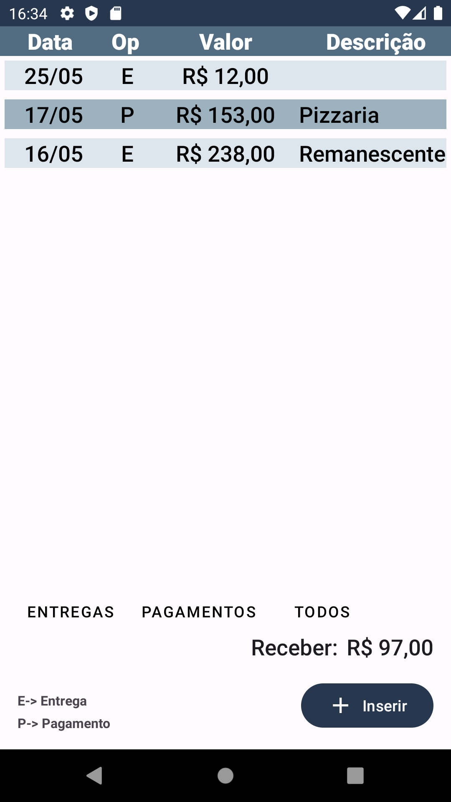
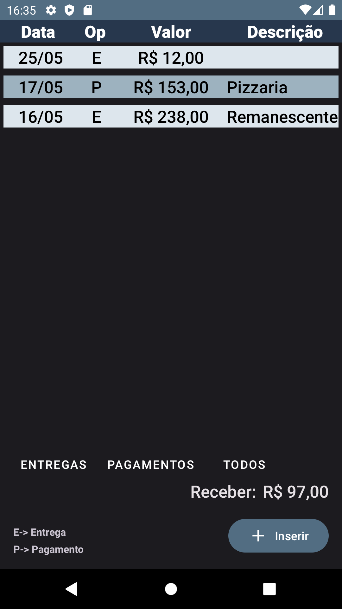
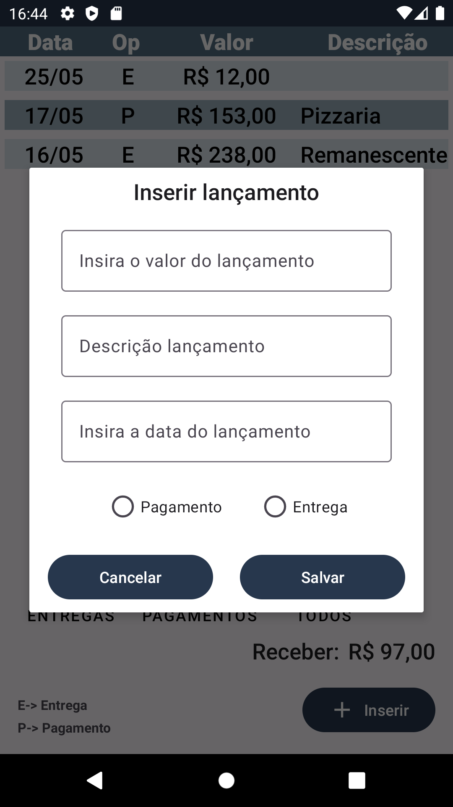

# Entregas

Aplicativo desenvolvido com intuito de gerenciar ganhos diarios com entregas, onde são inseridos os valores que o usuário fez, assim o aplicativo calcula e armazena os valores.

| Tema claro                   | Tema escuro                        | Inserir um valor                     |
|------------------------------------|--------------------------------------------------|------------------------------------------------|
|  |  |  |

Ultilizados:
* KOTLIN (linguagem de progração)
* XML (contrução de layouts)
* ACTIVITYS (logica das telas)
* COROUTINES (para executar tarefas fora da thread principal)
* ROOM (salvar os dados localmente)
